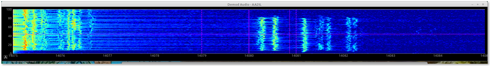
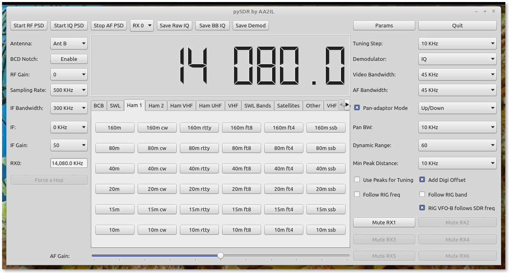

# World Clock

A complete SDR written in Python.  Supports both SDR Play RSP and RTL Dongle via Soapy SDR.  Can be used as stand alone or as a pan adaptor.  Rig interfacing accomplished via direct connection, flrig, fldigi or hamlib.

